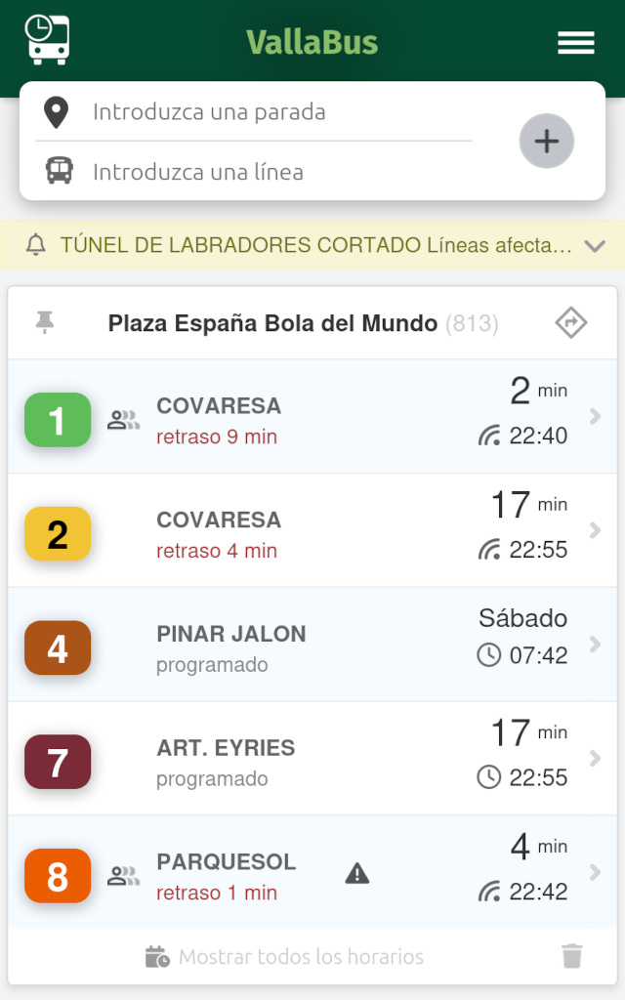

# VallaBus

Esta aplicación web permite a los usuarios llevar un seguimiento de las líneas de autobús y paradas que les interesan en Valladolid, España.

**[🚍 Acceder a la web e instalar](https://vallabus.com/)**



## Funcionalidades

* Agregar paradas y números de línea para hacerles seguimiento.
* Consultar el tiempo programado y real de llegada de las líneas.
* Visualización de retrasos o adelantos frente a la hora programada.
* Mostrar la información agrupada por paradas para facilitar la vista.
* Alertas de servicio en líneas afectadas.
* Seguimiento en el mapa de ubicación de autobuses.
* Eliminar paradas y líneas que el usuario ya no desee seguir.
* Los datos se almacenan en el navegadory persisten entre sesiones.
* Se puede instalar como una aplicación nativa (PWA).

## Tecnologías

* JavaScript.
* HTML/CSS.
* [api-auvasa](https://github.com/VallaBus/api-auvasa) para obtener datos en tiempo real del sistema de AUVASA.
* LocalStorage para almacenamiento en el cliente.
* PWA para la instalación nativa.

## Uso

1. Ingresar número de parada y línea a agregar.
2. La app consultará la API para validar que existan.
3. Se mostrará el tiempo programado y real (si está disponible) de llegada del próximo autobús.
4. Los datos se actualizan cada 30 segundos.

Esta sencilla app permite a los usuarios del bus en Valladolid llevar un seguimiento de las líneas y paradas de su interés para estar al tanto de los tiempos de llegada de los autobuses en tiempo real.

## Enlace externo al planificador

Una web externa puede abrir directamente el planificador con un destino y, opcionalmente, un origen y una llegada prevista. El planificador hace la búsqueda automáticamente al abrirse. El formato recomendado es:

```text
https://vallabus.com/#/rutas?originName=...&originLat=...&originLon=...&destinationName=...&destinationLat=...&destinationLon=...&arrivalDate=YYYY-MM-DD&arrivalTime=HH:MM&mode=transit
```

`destinationName`, `destinationLat` y `destinationLon` son obligatorios. Los tres parámetros `origin*` son opcionales: si se omiten, el origen queda vacío en el planificador. `arrivalDate` y `arrivalTime` también son opcionales, pero deben aparecer juntos. Los nombres deben estar codificados como parámetros de URL.
El parámetro `mode` también es opcional y admite `transit` o `bike`; con `bike` se selecciona Bici y se mantiene visible la opción de bicicleta junto al transporte público.

## Aviso de instalación para enlaces externos

Para mostrar el aviso sutil de instalación al abrir VallaBus desde otra web, añade el parámetro `origen` con un identificador de esa web. Se puede colocar en la query de la raíz:

```text
https://vallabus.com/?origen=mi-web
```

o junto a los parámetros del planificador dentro del hash:

```text
https://vallabus.com/#/rutas?destinationName=...&destinationLat=...&destinationLon=...&origen=mi-web
```

También se admite `origen=externo` como origen genérico. El botón del aviso registra en Matomo el evento `external-install / add_click` con el identificador de origen. Cuando la instalación PWA se completa en Android/navegadores compatibles, registra además `external-install / installed` con el mismo identificador. En iPhone solo se registra `add_click`.

Si la persona cierra el aviso, se guarda `externalInstallBannerDismissed` en `localStorage` y no vuelve a mostrarse. Tras una instalación completada se guarda `externalInstallBannerInstalled`; además, el aviso no se muestra dentro de una PWA instalada o de una aplicación Android/TWA.

Si el enlace con `origen` se abre dentro de la ventana standalone de otra PWA, el aviso sigue pudiendo mostrarse: `display-mode=standalone` no identifica por sí solo qué aplicación instalada es la propietaria de la ventana.
